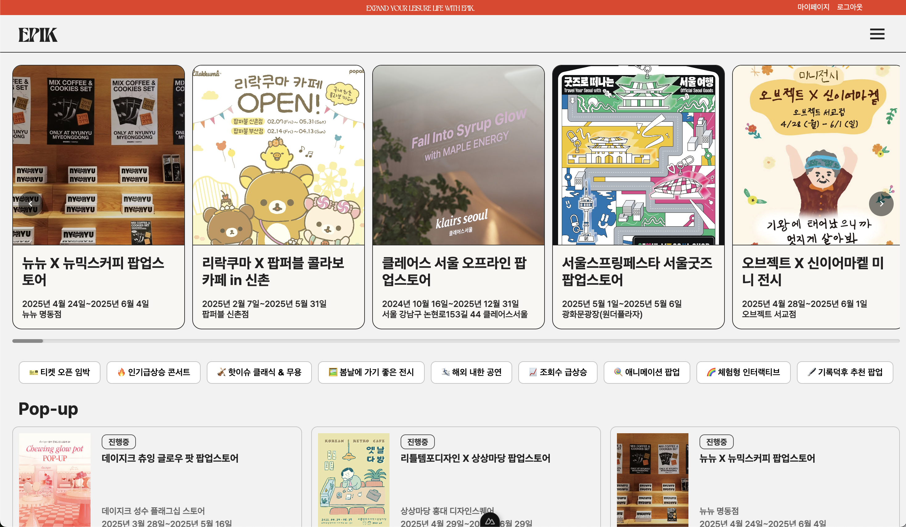

# EPIK (Every Place In Korea)
> 대한민국 곳곳의 문화 이벤트를 한눈에!   
> 팝업스토어, 콘서트, 전시회, 뮤지컬을 발견하고 관리하는 종합 문화 플랫폼

## 📌 프로젝트 개요

EPIK은 사용자가 다양한 문화 이벤트를 쉽게 찾고 관리할 수 있도록 돕는 웹 플랫폼입니다. 팝업스토어부터 콘서트, 전시회, 뮤지컬까지 - 문화 생활의 모든 것을 하나의 플랫폼에서 제공합니다.

### 🎯 주요 기능

- **종합 문화 이벤트 정보 제공**: 팝업스토어, 콘서트, 전시회, 뮤지컬 통합 관리
- **지역별 및 카테고리별 필터링**: 사용자 맞춤형 이벤트 탐색
- **관리자 백오피스**: 이벤트 정보 관리 및 사용자 관리
- **소셜 로그인**: 카카오, 네이버, 구글 간편 로그인
- **카카오맵 연동**: 공연장 위치 정보 제공

## 🛠 기술 스택

### Frontend

- **Framework**: Nuxt 3 (Vue 3)
- **상태 관리**: Pinia
- **애니메이션**: Lenis (부드러운 스크롤)
- **아이콘**: Boxicons
- **지도 API**: 카카오맵 API
- **에디터**: Toast UI Editor

### Backend

- **Framework**: Spring Boot 3.3.4
- **Language**: Java 21
- **Database**: MariaDB
- **ORM**: Spring Data JPA
- **인증**: Spring Security + JWT
- **OAuth2**: 카카오, 네이버, 구글 소셜 로그인
- **파일 업로드**: Multipart 파일 처리

### 개발 도구 및 기타

- **디자인**: Figma
- **버전 관리**: Git
- **패키지 매니저**: npm
- **빌드 도구**: Maven