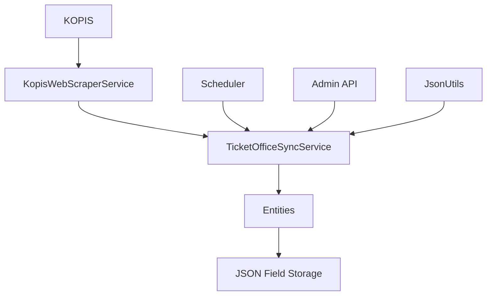

# KOPIS 티켓 예매처 스크래핑 시스템

## 개요

KOPIS 티켓 예매처 스크래핑 시스템은 KOPIS(공연예술통합전산망) 웹사이트에서 티켓 예매 정보를 자동으로 수집하고, 기존의 컨텐츠 엔티티와 통합하도록 설계되었습니다. 이 시스템은 웹 스크래핑 기술을 사용해 티켓 판매처 링크를 추출하고, 이를 데이터베이스에 JSON 형식으로 저장합니다.

## 아키텍처

### 시스템 구성 요소



### 주요 구성 요소

1.  **KopisWebScraperService**: Selenium WebDriver를 사용한 핵심 웹 스크래핑 로직
2.  **TicketOfficeSyncService**: 데이터 통합 및 저장을 위한 비즈니스 로직
3.  **TicketOfficeScheduler**: 배치 업데이트를 위한 자동 스케줄링
4.  **JsonUtils**: 안전한 JSON 처리를 위한 유틸리티 클래스
5.  **JSON Storage**: 뮤지컬/콘서트 엔티티 내 JSON 필드에 저장된 티켓 판매처 데이터

## 기술 구현

### 데이터 모델

#### JSON 필드 구조

```json
{
  "interpark": "https://ticket.interpark.com/goods/24001234",
  "ticketlink": "https://ticketlink.co.kr/product/12345",
  "yes24": "https://ticket.yes24.com/goods/67890",
  "auction": "https://ticket.auction.co.kr/goods/11111"
}
```

#### 데이터베이스 스키마 변경

```sql
-- musical 테이블 확장
ALTER TABLE musical 
ADD COLUMN ticket_offices JSON COMMENT '티켓 판매처 정보 (JSON 형식)',
ADD COLUMN ticket_offices_updated_at TIMESTAMP NULL COMMENT '최종 업데이트 타임스탬프',
ADD COLUMN ticket_offices_source ENUM('MANUAL', 'SCRAPED', 'MIXED') DEFAULT 'MANUAL' COMMENT '데이터 출처';

-- concert 테이블 확장
ALTER TABLE concert
ADD COLUMN ticket_offices JSON COMMENT '티켓 판매처 정보 (JSON 형식)',
ADD COLUMN ticket_offices_updated_at TIMESTAMP NULL COMMENT '최종 업데이트 타임스탬프',
ADD COLUMN ticket_offices_source ENUM('MANUAL', 'SCRAPED', 'MIXED') DEFAULT 'MANUAL' COMMENT '데이터 출처';
```

### 핵심 클래스

#### 1\. TicketScrapeResult

```java
@Data
@Builder
public class TicketOfficeInfoDto {
    private String officeName;    // 정규화된 이름 (예: "interpark")
    private String displayName;   // 표시 이름 (예: "인터파크")
    private String ticketUrl;     // 실제 예매 URL
    private String kopisId;       // 관련 KOPIS 공연 ID
    private LocalDateTime scrapedAt;
}
```

#### 2\. KopisWebScraperService

- **목적**: KOPIS 웹사이트에서 웹 스크래핑 수행
- **기술**: Selenium WebDriver 및 Chrome
- **기능**:
    - 헤드리스(Headless) 브라우저 작동
    - 동적 팝업 처리
    - 다중 셀렉터(selector) 대체 전략
    - 안전한 WebDriver 리소스 관리

#### 3\. TicketOfficeSyncService

- **목적**: 비즈니스 로직 및 데이터 통합
- **기능**:
    - 수동 입력 데이터와 스크래핑 데이터 병합
    - JSON 필드 관리
    - 배치 처리 기능
    - 트랜잭션 관리

### 설정

#### 애플리케이션 속성

```yaml
scraping:
  enabled: true
  delay-between-requests: 3000
  timeout-seconds: 15
  headless-mode: true
  max-retry-count: 3
  user-agent: "Mozilla/5.0 (Windows NT 10.0; Win64; x64) AppleWebKit/537.36"
```

## API 엔드포인트

### 관리자 API

#### 스크래핑 테스트

```http
GET /api/admin/ticket/scrape/{kopisId}
```

- **목적**: 특정 KOPIS ID에 대한 스크래핑 테스트
- **응답**: TicketOfficeInfoDto 객체 목록

#### 단일 뮤지컬 업데이트

```http
POST /api/admin/ticket/musical/{musicalId}/update
```

- **목적**: 특정 뮤지컬의 티켓 판매처 업데이트
- **응답**: 성공/실패 메시지

#### 단일 콘서트 업데이트

```http
POST /api/admin/ticket/concert/{concertId}/update
```

- **목적**: 특정 콘서트의 티켓 판매처 업데이트
- **응답**: 성공/실패 메시지

#### 배치 업데이트

```http
POST /api/admin/ticket/musical/update-all
POST /api/admin/ticket/concert/update-all
```

- **목적**: 모든 뮤지컬/콘서트 업데이트 (백그라운드 처리)
- **응답**: 프로세스 시작 확인

## 스케줄링

### 자동화된 작업

**일일 업데이트**: 매일 오전 2시

    - 모든 공연의 티켓 판매처 정보 업데이트
    - 뮤지컬과 콘서트 모두 처리

## 사용 예시

### 티켓 판매처 데이터 접근

#### 엔티티로부터

```java
Musical musical = musicalRepository.findById(id);
Map<String, String> ticketOffices = musical.getTicketOffices();

// 특정 판매처 존재 여부 확인
boolean hasInterpark = musical.hasTicketOffice("interpark");

// 특정 판매처 URL 가져오기
String interparkUrl = musical.getTicketOfficeUrl("interpark");
```

#### API 응답으로부터

```json
{
  "id": 123,
  "title": "레 미제라블",
  "ticketOffices": {
    "interpark": "https://ticket.interpark.com/goods/24001234",
    "ticketlink": "https://ticketlink.co.kr/product/12345"
  },
  "ticketOfficesUpdatedAt": "2025-01-15T10:30:00"
}
```

## 오류 처리

### 일반적인 시나리오

1.  **WebDriver 문제**

    - 실패 시 드라이버 자동 정리
    - 빈 결과 목록으로 대체
    - 상세한 오류 로깅

2.  **JSON 구문 분석 오류**

    - 빈 맵(map)으로 안전하게 대체
    - JSON 구조 유효성 검사
    - 맥락 정보와 함께 오류 로깅

3.  **네트워크 타임아웃**

    - 설정 가능한 타임아웃 값
    - 점진적 성능 저하(graceful degradation)
    - 재시도 메커니즘 (추후 예정)

## 성능 고려 사항

### 최적화

1.  **JSON 스토리지 장점**

    - JOIN 작업 제거
    - 모든 티켓 판매처를 단일 쿼리로 조회
    - 빠른 응답 시간

2.  **리소스 관리**

    - WebDriver 인스턴스 정리
    - 메모리 사용량 모니터링
    - 요청 속도 제한

### 모니터링

#### 주요 지표

- 스크래핑 성공률
- 응답 시간
- JSON 필드 크기
- 업데이트 빈도

#### 데이터베이스 쿼리

```sql
-- JSON 필드 크기 확인
SELECT 
    id, title,
    CHAR_LENGTH(ticket_offices) as json_size,
    JSON_LENGTH(ticket_offices) as office_count
FROM musical 
WHERE ticket_offices IS NOT NULL
ORDER BY json_size DESC;

-- 티켓 판매처 사용 통계
SELECT 
    JSON_UNQUOTE(JSON_EXTRACT(ticket_offices, CONCAT('$."', office_keys.office_key, '"'))) as office_url,
    COUNT(*) as usage_count
FROM musical
CROSS JOIN JSON_TABLE(
    JSON_KEYS(ticket_offices), 
    '$[*]' COLUMNS (office_key VARCHAR(50) PATH '$')
) as office_keys
WHERE ticket_offices IS NOT NULL
GROUP BY office_keys.office_key;
```

## 보안 및 규정 준수

### 웹 스크래핑 윤리

- robots.txt 지시문 준수
- 요청 지연 시간 구현 (3초 이상)
- 적절한 User-Agent 문자열 사용
- 대상 서버에 과부하를 주지 않도록 주의

### 데이터 프라이버시

- 개인 정보 수집 없음
- 공개된 티켓 판매처 URL만 수집
- 서비스 약관 준수

## 배포

### 필수 조건

- 서버에 Google Chrome 설치
- Selenium WebDriver 종속성
- Java 21+ 런타임 환경
- JSON 지원이 가능한 MySQL 8.0+

### 환경 변수

```bash
SCRAPING_ENABLED=true
SCRAPING_HEADLESS_MODE=true
SCRAPING_DELAY_BETWEEN_REQUESTS=3000
```

### Docker 고려 사항

```dockerfile
# Docker 컨테이너에 Chrome 설치
RUN apt-get update && apt-get install -y \
    wget gnupg \
    && wget -q -O - https://dl.google.com/linux/linux_signing_key.pub | apt-key add - \
    && echo "deb [arch=amd64] http://dl.google.com/linux/chrome/deb/ stable main" >> /etc/apt/sources.list.d/google-chrome.list \
    && apt-get update \
    && apt-get install -y google-chrome-stable
```

## 테스트

### 단위 테스트

```java
@Test
void testTicketOfficeJsonProcessing() {
    Map<String, String> offices = Map.of("interpark", "https://example.com");
    musical.setTicketOffices(offices);
    
    assertEquals("https://example.com", musical.getTicketOfficeUrl("interpark"));
    assertTrue(musical.hasTicketOffice("interpark"));
}
```

### 통합 테스트

- WebDriver 기능 테스트
- 데이터베이스 JSON 필드 연산 테스트
- API 엔드포인트 유효성 검사

## 문제 해결

### 일반적인 문제

1.  **Chrome Driver 문제**

    ```bash
    # Chrome 버전 확인
    google-chrome --version

    # WebDriver 호환성 확인
    ```

2.  **JSON 필드 오류**

    ```sql
    -- JSON 구조 유효성 검사
    SELECT id, title, JSON_VALID(ticket_offices) as is_valid
    FROM musical 
    WHERE ticket_offices IS NOT NULL;
    ```

3.  **스크래핑 실패**

    - 네트워크 연결 확인
    - KOPIS 웹사이트 구조 확인
    - 상세한 오류를 위해 로그 파일 검토

### 모니터링 쿼리

```sql
-- 최근 스크래핑 활동
SELECT 
    ticket_offices_source,
    COUNT(*) as count,
    MAX(ticket_offices_updated_at) as last_update
FROM musical 
GROUP BY ticket_offices_source;

-- 티켓 판매처가 없는 공연 찾기
SELECT id, title, kopis_id 
FROM musical 
WHERE kopis_id IS NOT NULL 
AND (ticket_offices IS NULL OR JSON_LENGTH(ticket_offices) = 0);
```

## 향후 개선 사항

### 계획된 기능

1.  **WebDriver 풀**: 성능 향상을 위한 연결 풀링
2.  **재시도 로직**: 실패한 스크래핑 시도에 대한 자동 재시도
3.  **서킷 브레이커**: 내결함성 패턴
4.  **캐싱 레이어**: 자주 조회되는 쿼리를 위한 Redis 캐싱
5.  **비동기 처리**: 논블로킹(non-blocking) 배치 작업
6.  **모니터링 대시보드**: 실시간 스크래핑 지표 제공

### 확장성 고려 사항

- 메시지 큐를 통한 수평 확장
- 대용량 데이터셋을 위한 데이터베이스 샤딩
- 정적 리소스를 위한 CDN 통합
- API 속도 제한 및 스로틀링